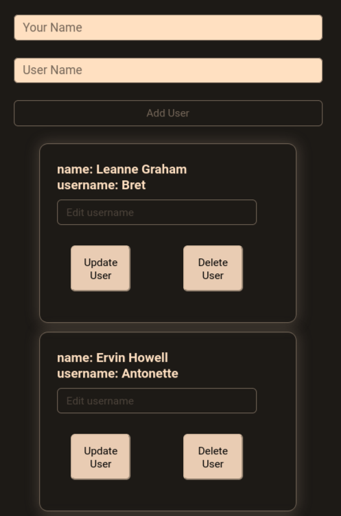

## DESCRIPTION:
A simple CRUD app using React + Redux Toolkit.

## OUTCOME:
Getting used to Redux Toolkit.

## TECH STACKS:
- JS framework: React.
- State Management: useState, Redux Toolkit.
- Styling: css.

## PROGRESS:
- Done

### Error Message(s):
"xoxo"

## How to run
`yarn install`
`yarn start`

## IMAGE:

